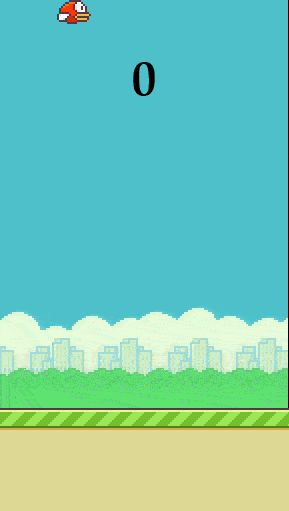

# Control Flappy Bird with MediaPipe Hand Tracking

This repo contains a simple game of controlling the vertical motion of [flappy bird game](https://codewithharry.com/videos/python-tutorials-for-absolute-beginners-122) with the average finger joint flexion angles obtained from [Google MediaPipe](https://github.com/google/mediapipe) 3D hand tracking with color image.

